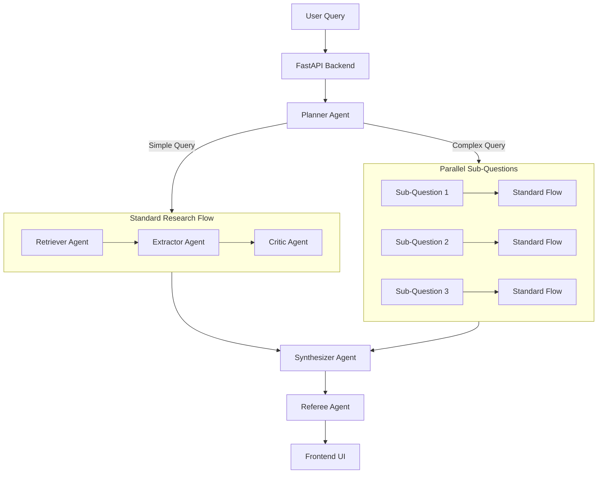

# Multi-Agent Scientific Research Assistant

A powerful research assistant that uses a multi-agent AI pipeline to answer scientific questions. It retrieves papers from Semantic Scholar, analyzes them using LLMs, and synthesizes evidence-based answers with citations, confidence scores, and bias assessments.

## ✨ Key Features

- **Deep Research Mode**: Automatically breaks down complex questions into sub-questions and researches them in parallel.
- **Multi-Agent Pipeline**:
  - **Planner Agent**: Decomposes queries and determines research strategy.
  - **Retriever Agent**: Searches Semantic Scholar for relevant academic papers.
  - **Extractor Agent**: Extracts key findings, sample sizes, and study types from abstracts.
  - **Critic Agent**: Assesses risk of bias and methodological quality.
  - **Synthesizer Agent**: Groups findings by theme and produces a direct, citation-grounded answer.
  - **Referee Agent**: Verifies that citations match the claims made.
- **Real-time Progress Transparency**: Watch the agents work in real-time with a modern, glassmorphism-styled UI widget.
- **Evidence Table**: View structured data extraction for every cited paper (Study Type, Effect Direction, Bias Risk).
- **Quality Metrics**: Every answer includes a confidence score and rationale based on evidence quality (RCTs > Observational).

## ARCHITECTURE



## 🛠️ Setup

### 1. Backend

```bash
cd backend
python -m venv .venv
source .venv/bin/activate
pip install -r requirements.txt
```

**Configuration (`backend/.env`):**
```env
HF_TOKEN=your_huggingface_token
HF_MODEL=meta-llama/Llama-3.1-8B-Instruct
SEMANTIC_SCHOLAR_API_KEY=optional_key
```

Run the server:
```bash
uvicorn main:app --reload
```

### 2. Frontend

```bash
cd frontend
npm install
npm run dev
```

## 🚀 Usage

1. Open `http://localhost:5173`
2. Ask a research question (e.g., *"Does mindfulness meditation improve sleep quality?"*)
3. Watch the agents plan, retrieve, extract, and synthesize.
4. Review the final answer, confidence score, and evidence table.

## 🧠 Agent details

- **Planner**: Uses heuristics and LLM to decide if a question needs decomposition.
- **Extractor**: Extracts structured data (N, population, effect size) from abstracts using keyword pattern matching and LLM refinement.
- **Synthesizer**: Weighs evidence (Meta-analysis > RCT) and synthesizes findings into themes, prioritizing a direct answer to the user's question.

## ⚠️ Limitations

- Analysis is primarily abstract-based (full-text analysis is a future goal).
- "Deep Research" mode can take longer (30-60s) but provides more comprehensive coverage.
- Requires a HuggingFace API token for optimal quality (falls back to heuristics if unavailable).
