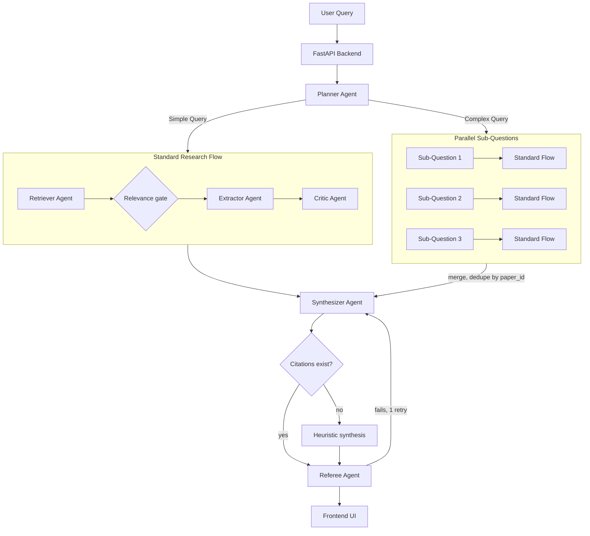

# Multi-Agent Scientific Research Assistant

A powerful research assistant that uses a multi-agent AI pipeline to answer scientific questions. It retrieves papers from Semantic Scholar, analyzes them using LLMs, and synthesizes evidence-based answers with citations, confidence scores, and bias assessments.

## Key Features

- **Deep Research Mode**: Automatically breaks down complex questions into sub-questions and researches them in parallel.
- **Multi-Agent Pipeline**:
  - **Planner Agent**: Decomposes queries and determines research strategy.
  - **Retriever Agent**: Searches Semantic Scholar, then filters results for topical relevance.
  - **Extractor Agent**: Pulls the sentence that reports what a study *found*, plus sample sizes and study types.
  - **Critic Agent**: Assesses risk of bias and methodological quality.
  - **Synthesizer Agent**: Groups findings by theme and produces a direct, citation-grounded answer.
  - **Referee Agent**: Verifies that citations match the claims made.
- **Real-time Progress Transparency**: Watch the agents work in real-time with a modern, glassmorphism-styled UI widget.
- **Evidence Table**: View structured data extraction for every cited paper (Study Type, Effect Direction, Bias Risk).
- **Quality Metrics**: Every answer includes a confidence score and rationale based on evidence quality (RCTs > Observational).
- **Evidence Integrity**: A synthesis that cites a paper outside the retrieved evidence set is discarded rather than shown. Every stage degrades to a deterministic heuristic instead of failing.

## ARCHITECTURE


```mermaid
graph TD
    User[User Query] --> API[FastAPI Backend]
    API --> Planner[Planner Agent]
    
    Planner -- "Simple Query" --> SingleFlow
    Planner -- "Complex Query" --> DeepResearch[Deep Research Mode]
    
    subgraph SingleFlow [Standard Research Flow]
        Retriever[Retriever Agent] --> Relevance{Relevance gate}
        Relevance --> Extractor[Extractor Agent]
        Extractor --> Critic[Critic Agent]
    end
    
    subgraph DeepResearch [Parallel Sub-Questions]
        SubQ1[Sub-Question 1] --> Flow1[Standard Flow]
        SubQ2[Sub-Question 2] --> Flow2[Standard Flow]
        SubQ3[Sub-Question 3] --> Flow3[Standard Flow]
    end
    
    SingleFlow --> Synthesizer[Synthesizer Agent]
    DeepResearch -- "merge, dedupe by paper_id" --> Synthesizer
    
    Synthesizer --> Integrity{Citations exist?}
    Integrity -- "no" --> Fallback[Heuristic synthesis]
    Integrity -- "yes" --> Referee[Referee Agent]
    Fallback --> Referee
    Referee -- "fails, 1 retry" --> Synthesizer
    Referee --> UI[Frontend UI]
```

## Setup

### 1. Backend

```bash
python -m venv .venv
source .venv/bin/activate
pip install -r backend/requirements.txt
```

**Configuration (`backend/.env`):**
```env
HF_TOKEN=your_huggingface_token
HF_MODEL=meta-llama/Llama-3.1-8B-Instruct
HF_MAX_CONCURRENCY=5
SEMANTIC_SCHOLAR_API_KEY=optional_key
SEMANTIC_SCHOLAR_MIN_INTERVAL_S=1.2   # 3.0 when no API key is set
CORS_ORIGINS=http://localhost:5173,http://127.0.0.1:5173
```

Semantic Scholar rejects bursts with HTTP 429, and deep research issues several
searches per run. Requests are serialized behind a shared lock and spaced by
`SEMANTIC_SCHOLAR_MIN_INTERVAL_S`; lower it only if you have a high-quota key.

Run the server:
```bash
uvicorn backend.main:app --reload
```

### 2. Frontend

```bash
cd frontend
npm install
npm run dev
```

The frontend uses same-origin `/api` requests by default (proxied to port 8000 in development).
For a separately hosted API, set `VITE_API_BASE_URL` in the frontend environment.

### 3. Verification

```bash
python -m unittest discover -s backend/tests -v
ruff check backend
cd frontend && npm run build
```

## Usage

1. Open `http://localhost:5173`
2. Ask a research question (e.g., *"Does mindfulness meditation improve sleep quality?"*)
3. Watch the agents plan, retrieve, extract, and synthesize.
4. Review the final answer, confidence score, and evidence table.

## Agent details

- **Planner**: Uses heuristics and LLM to decide if a question needs decomposition. A
  `decompose` plan with fewer than two sub-questions is demoted to `direct`, so
  contradictory plans cannot reach orchestration.
- **Retriever**: Tries up to three query phrasings, then applies a relevance gate. A paper
  must mention the question's *subject* (the "X" in "effects of X on Y") and clear a
  term-overlap threshold. Without this, a search for creatine returns papers on unrelated
  topics that merely share an outcome word, and they flow through the pipeline as evidence.
  The gate never returns an empty set — the best-scoring papers survive so a run degrades
  to weak evidence rather than none.
- **Extractor**: Splits structured abstracts into sections and scores every sentence to
  find the one that reports a *result*. Results/Conclusions sections score up;
  Background/Objective/Methods score down; quantitative markers (`p = .04`, `95% CI`,
  `d = 0.77`) score up; future tense scores down so registered protocols never present
  planned work as a finding. Effect direction is negation-aware, so "no significant
  improvement" resolves to `null` rather than `positive`.
- **Synthesizer**: Weighs evidence (meta-analysis > RCT > observational) and groups
  findings into themes, leading with a direct answer. LLM output is normalized before
  schema validation — bullets returned as `{"text": ..., "citation": ...}` objects are
  folded into strings, and citation labels are resolved back to paper ids.
- **Referee**: Deterministic. Checks that every bullet carries a citation, every label
  exists, `citations_used` matches the inline labels, and confidence is not high while
  high-bias studies are present. On failure the synthesizer re-runs once with the issues.

## Confidence score

Two paths produce the number, depending on whether the LLM synthesis succeeded.

**LLM path** — `confidence_score` is whatever the model reported, bounded to 0–100. The
referee flags a score above 75 when any high-bias study is present.

**Heuristic path** — computed in `_fallback_synthesis`:

```text
score  = 35                                  # base
       + min(20, 7 * log2(1 + n_papers))     # volume, saturating
       + 25 * (n_rct_or_review / n_studies)  # study quality
       - 25 * (n_high_bias   / n_assessed)   # bias, proportional
       - 8  * (n_medium_bias / n_assessed)
       +/- agreement adjustment              # +6 clear direction, -8 genuinely split
       -> capped at 40 if fewer than 3 papers, then clamped to [10, 90]
```

Agreement uses a quality-weighted share of positive findings (meta-analysis 3.0,
systematic review 2.5, RCT 2.0, observational 1.0, unknown 0.5).

Design notes:

- **Volume saturates.** The third paper adds far more than the twelfth, and the term caps
  at 20 points, so retrieving more papers cannot manufacture confidence.
- **Bias penalties are proportional**, not absolute counts. Counting them absolutely meant
  a large body of medium-bias evidence scored worse than a single unassessed study.
- **Agreement beats direction.** A consistently negative result earns the same bonus as a
  consistently positive one; only genuinely split evidence is penalized.

Confidence describes the *shape of the retrieved evidence*, not whether the answer is
correct. It cannot detect a misread paper or a systematically biased literature.

## Graceful degradation

Every failure lands one rung down rather than erroring out:

1. **LLM synthesis, verified** — real prose and citations, referee passes.
2. **LLM synthesis, retried once** — referee found citation problems; issues are appended
   to the prompt and the synthesizer runs again.
3. **Heuristic synthesis** — LLM unavailable, malformed, or caught citing papers absent
   from the evidence set. Findings are quoted directly from abstracts.
4. **No-evidence response** — no papers survived retrieval. A rate-limited search is
   reported as such rather than as "no research exists on this topic".

## Limitations

- Analysis is primarily abstract-based (full-text analysis is a future goal).
- "Deep Research" mode can take longer (30-60s) but provides more comprehensive coverage.
- Requires a HuggingFace API token for optimal quality (falls back to heuristics if
  unavailable). A depleted HuggingFace account returns `402 Payment Required`, which
  looks like any other request failure from inside the pipeline — the symptom is a run
  where no output reads like written prose.
- Because bias assessment is abstract-only, most studies land on `medium`, which limits
  how much the bias term can discriminate.
- Relevance filtering is lexical. A paper that uses the subject term in an unrelated sense
  (for example, creatine as a *measurement method* rather than a supplement) can pass.
